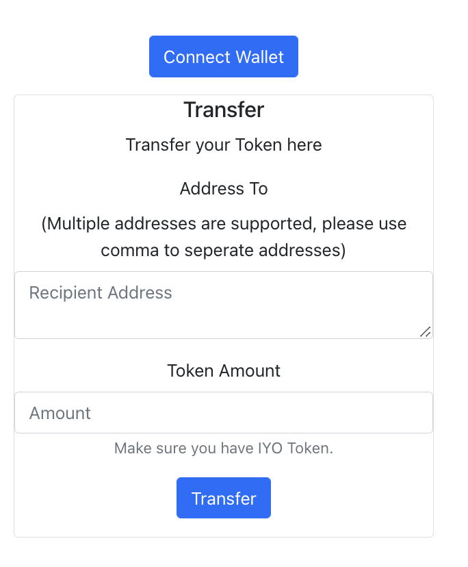
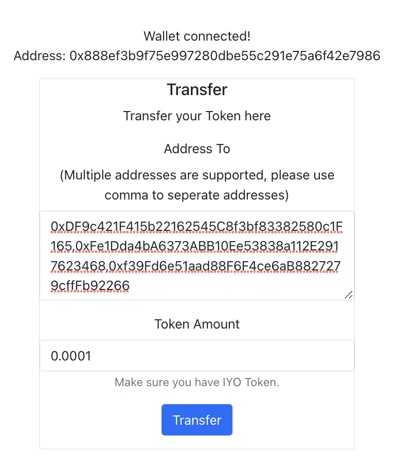
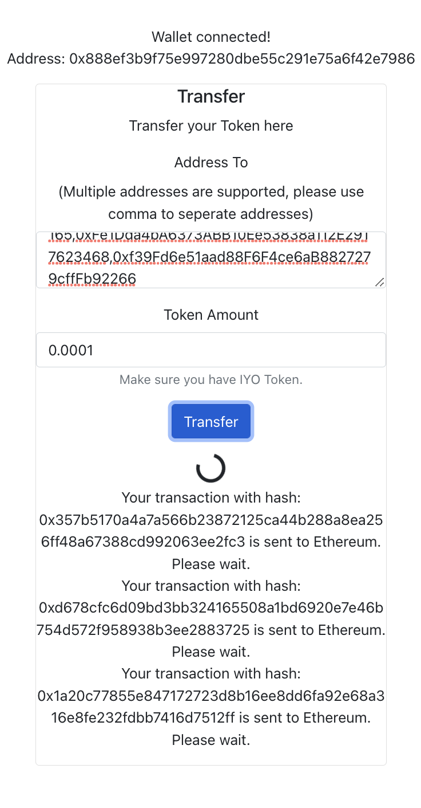
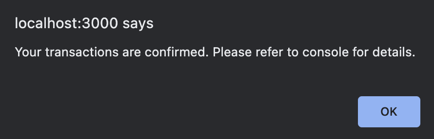
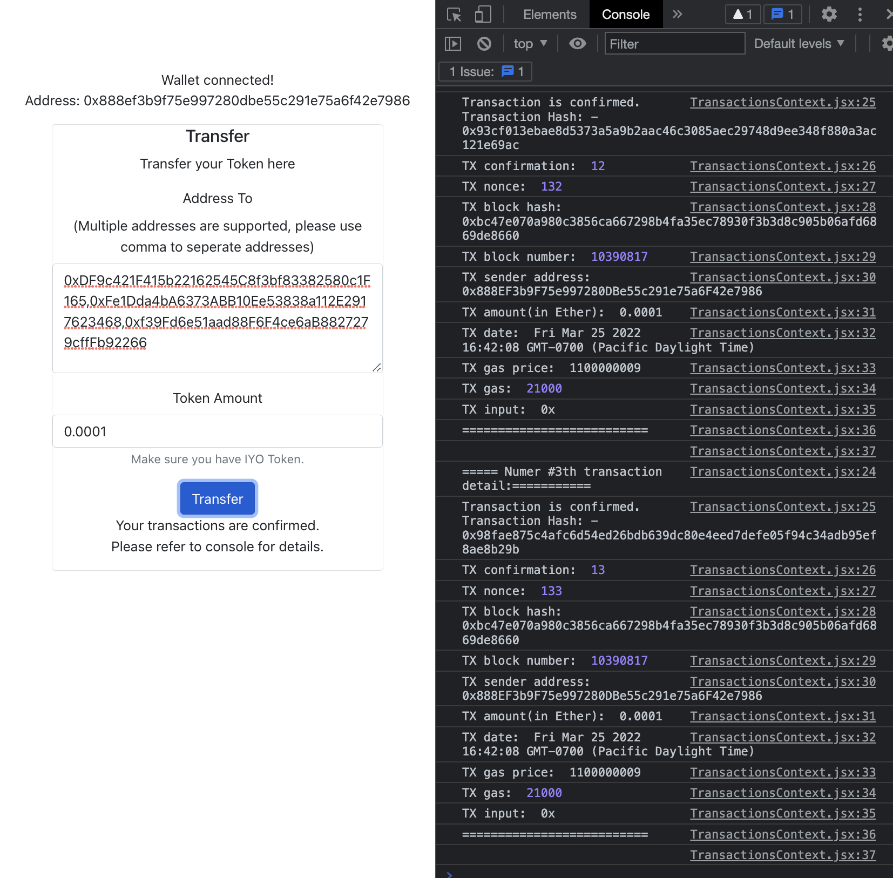

# Project Introduction
This project implements an end-to-end web3 token transfer UI, with a frontend performs the transactions and backend transfer event listening service.

When the user inputs the address(multiple addresses are supported!) and token amount, by clicking the Transfer button, the entered amount is transferred to the target address. 

After the transaction is completed, an alert on the UI will tell the user the transaction is completed. 

At the same time, in the backend, the actual token transaction event is subscribed and print to console the transaction user just made.

The project runs on Rinkeby Ethereum testnet, you can change it [here](./web3/src/utils/constants.js). 

# Some capscreens
Starting Page

After connecting wallet and inputting address & transfer amount

After clicking Transfer button, loading screen is shown

After the transaction is confirmed on blockchain, alert the user that transaction has finished

Corresponding details of the transactions are printed to console 

# Getting Started
First, please replace your private key at [constants.js](./web3/src/utils/constants.js)

Enter ./web3 folder and run the following command to start the web server

### `npm run start`

The project should starts at [https://localhost:3000](https://localhost:3000)

I have implemented 3 methods to transfer token, you can refer to [TransactionsContext.jsx](./web3/src/context/TransactionsContext.jsx) for more details.

Currently I have tested #1 and #3 methods are working fine, and relying on #3 method for sending batchRequest.

As for the subcription to Transfer event, I chose to track incoming blockHeaders and confirm the transaction if transaction hashes match the information in the blocks.

P.S.: If you want to deploy your smart contract(not necessary to see the above result), you can enter ./smart_contracts/ and run
### `npx hardhat run scripts/deploy.js --network {networkName} pk={yourPrivateKey}`
Remember to replace networkName and yourPrivateKey with {ropsten/rinkeby} and your private key

