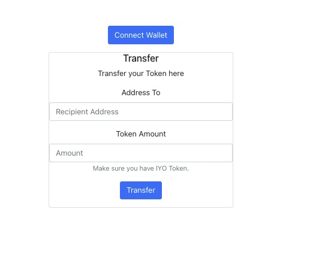
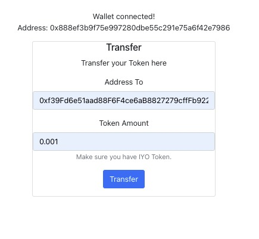
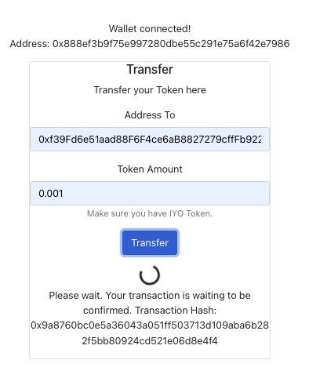
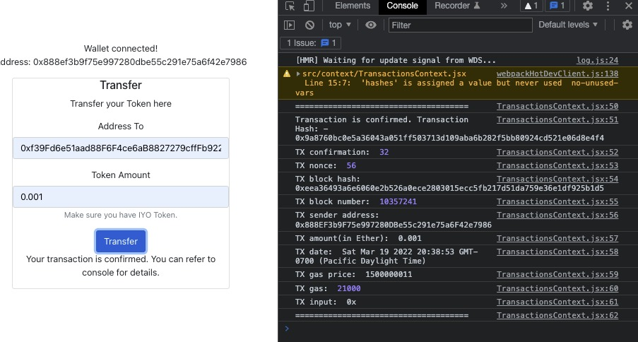

# Project Introduction
This project implements an end-to-end web3 token transfer UI, with a frontend performs the transactions and backend transfer event listening service.

When the user inputs the corresponding information and submit the request, the entered amount is transferred to the target address. 

After the transaction is completed, an alert on the UI will tell the user the transaction is completed. 

At the same time, in the backend, the actual token transaction event is subscribed and print to console the transaction user just made.

The project runs on Rinkeby Ethereum testnet, you can change it [here](./web3/src/utils/constants.js)

# Some capscreens
Starting Page

After connecting wallet

After clicking transfer button, metamask page is shown

After confirming on metemask

After the transaction is confirmed on blockchain, print the details to console

# Getting Started
Enter ./web3 folder and run the following command to start the web server

### `npm run start`

The project should starts at [http://localhost:3000](http://localhost:3000)

If you want to deploy your smart contract, you can enter ./smart_contracts/ and run
### `npx hardhat run scripts/deploy.js --network {networkName} pk={yourPrivateKey}
Remember to replace networkName and yourPrivateKey with {ropsten/rinkeby} and your private key

I have implemented 3 methods to transfer token, you can refer to [TransactionsContext.jsx](./web3/src/context/TransactionsContext.jsx) for more details.

If you want to try method 2 or 3, please replace your private key at [constants.js](./web3/src/utils/constants.js)

